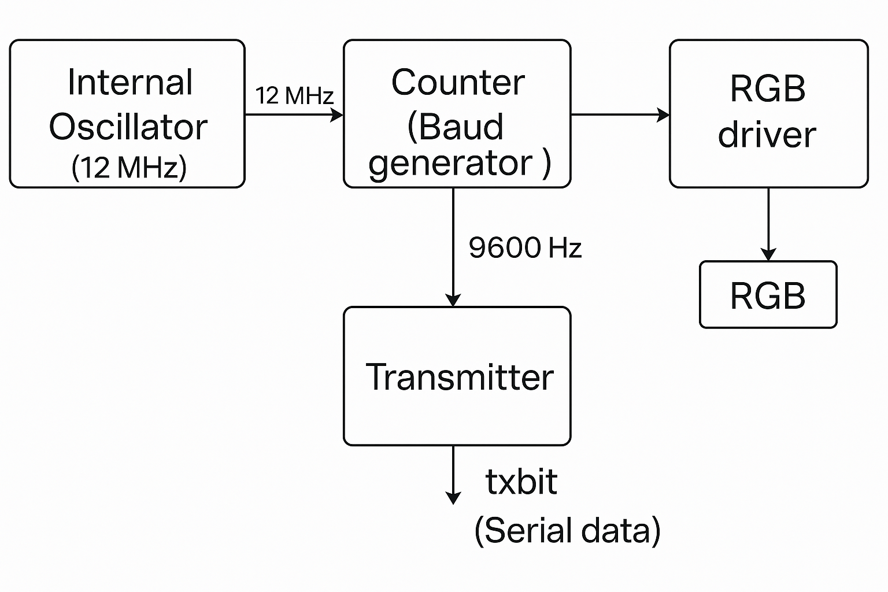
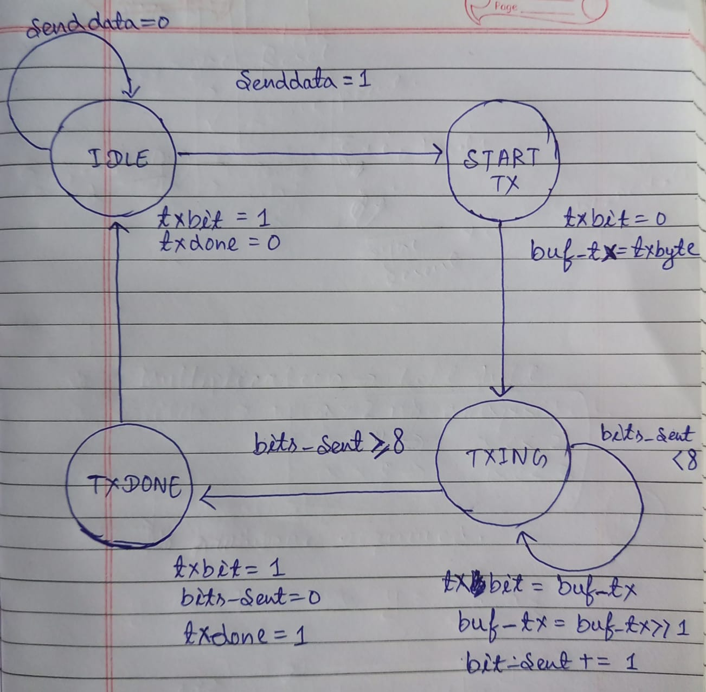
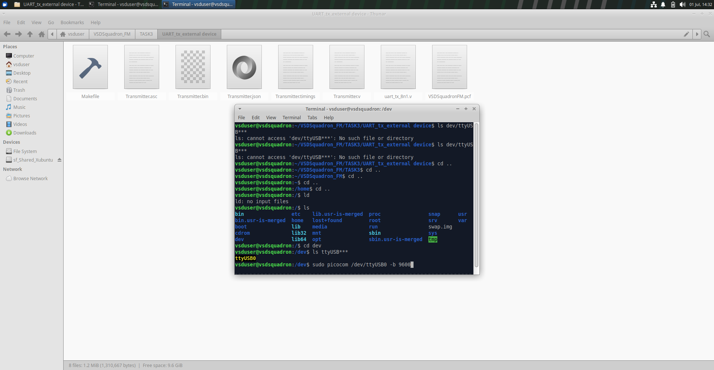
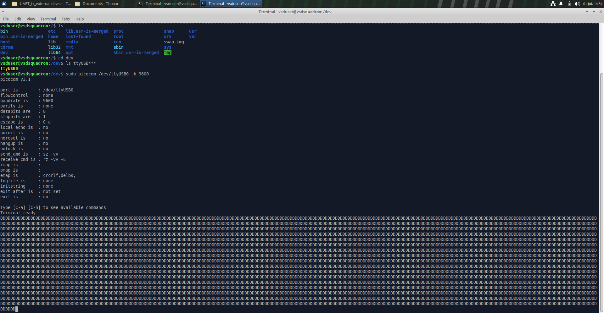
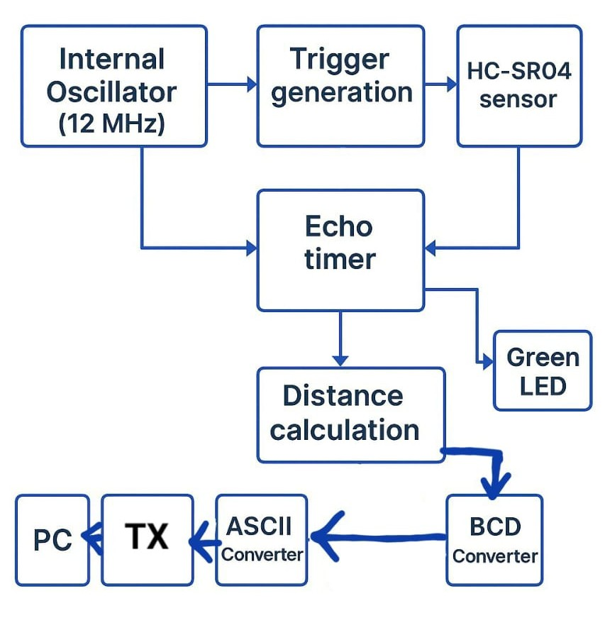
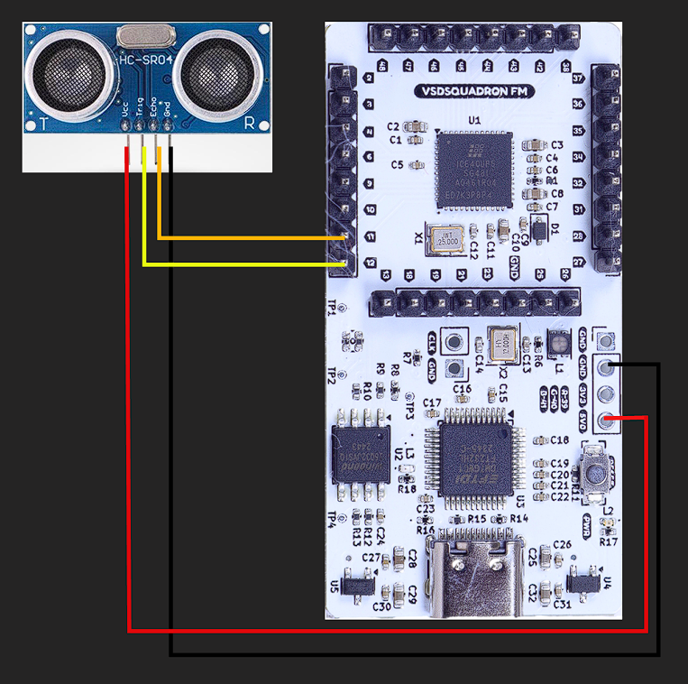

## This repository contains projects implemented on VSDSquadron FPGA Mini development board.
The VSDSquadron FPGA Mini (FM) board is a compact and versatile prototyping platform developed by [VLSI System Design](https://www.vlsisystemdesign.com/) featuring an onboard FPGA programmer, dedicated flash memory, user-controllable RGB LED and full access to FPGA I/O pins—enabling seamless development and experimentation.

Find out more at : [VSDSquadron FM](https://www.vlsisystemdesign.com/vsdsquadronfm/)

# TASK-1

## Purpose of the module :

The Verilog module `blue_fade.v` implements a fading effect on the **blue LED** using the hardware clock on board and pulse-width modulation (PWM). The design demonstrates a smooth brightness control using counters and PWM logic.

---

## Module Declaration

```verilog
module blue_fade (
  output wire led_red,
  output wire led_blue,
  output wire led_green,
  input wire hw_clk,
  output wire testwire
);
```

This defines the top-level interface to the module:
- Controls three LED outputs (Red, Blue, Green)
- Accepts an external hardware clock (`hw_clk`)
- Outputs a debug signal (`testwire`)

---

## Ports

| Port       | Direction | Description                                                                 |
|------------|-----------|-----------------------------------------------------------------------------|
| `led_red`  | Output    | Drives the red LED. Always off in this design.                              |
| `led_blue` | Output    | Drives the blue LED. Modulated using PWM for fading effect.                 |
| `led_green`| Output    | Drives the green LED. Always off in this design.                            |
| `hw_clk`   | Input     | Hardware clock input driving all logic.                                     |
| `testwire` | Output    | Debug signal derived from bit 5 of frequency counter. Useful for testing.   |

---

## Internal Oscillator (Not Used)

```verilog
wire int_osc;
SB_HFOSC u_SB_HFOSC (
  .CLKHFPU(1'b1),
  .CLKHFEN(1'b1),
  .CLKHF(int_osc)
);
```

The internal oscillator is instantiated but not used in this design. The module uses the external `hw_clk` as its actual clock source.

---

## Frequency Counter

```verilog
reg [27:0] frequency_counter_i = 0;

always @(posedge hw_clk) begin
  frequency_counter_i <= frequency_counter_i + 1'b1;
end

assign testwire = frequency_counter_i[5];
```

- A 28-bit counter that increments with every rising edge of `hw_clk`.
- Bit 5 is connected to `testwire`, producing a low-frequency square wave useful for debugging or probing signal activity.
- `frequency_counter_i[24:21]` controls which brightness level is currently active — like stepping through a brightness animation frame-by-frame.
---

## PWM Counter

```verilog
reg [7:0] pwm_counter = 0;
always @(posedge hw_clk) pwm_counter <= pwm_counter + 1;
```

- An 8-bit counter used to produce the pulse-width modulation signal.
- Repeats every 256 clock cycles, forming the base of the PWM wave.

---

## Duty Cycle Control

```verilog
reg [7:0] duty_cycle;
always @(*) begin
  case (frequency_counter_i[24:21])
    4'd0 :  duty_cycle = 32;
    4'd1 :  duty_cycle = 64;
    4'd2 :  duty_cycle = 96;
    4'd3 :  duty_cycle = 128;
    4'd4 :  duty_cycle = 160;
    4'd5 :  duty_cycle = 192;
    4'd6 :  duty_cycle = 224;
    4'd7 :  duty_cycle = 255;
    4'd8 :  duty_cycle = 224;
    4'd9 :  duty_cycle = 192;
    4'd10:  duty_cycle = 160;
    4'd11:  duty_cycle = 128;
    4'd12:  duty_cycle = 96;
    4'd13:  duty_cycle = 64;
    4'd14:  duty_cycle = 32;
    4'd15:  duty_cycle = 0;
    default: duty_cycle = 0;
  endcase
end
```

- Based on bits `[24:21]` of the frequency counter, this logic generates a **triangular waveform pattern** for brightness.
- The 4 bit  wide counter  goes from 0 to 15 giving 16 distinct brightness levels.

- The duty cycle gradually ramps from 32 to 255, then decrease symmetrically  forming a triangular wave, repeating endlessly.
- This results in a smooth fade-in and fade-out effect for the blue LED.

---

## PWM Signal Generation

```verilog
wire pwm_signal = (pwm_counter < duty_cycle);
```

- Compares `pwm_counter` to `duty_cycle` to generate a square wave.
- When the counter is less than the duty cycle, the output is HIGH.
- This HIGH duration determines the average voltage level to blue LED. More on **PWM** method at [LINK](https://www.geeksforgeeks.org/electronics-engineering/pulse-width-modulation-pwm/).
---

## RGB LED Driver

```verilog
SB_RGBA_DRV RGB_DRIVER (
  .RGBLEDEN(1'b1),
  .RGB0PWM(1'b0),
  .RGB1PWM(1'b0),
  .RGB2PWM(pwm_signal),
  .CURREN(1'b1),
  .RGB0(led_red),
  .RGB1(led_green),
  .RGB2(led_blue)
);

defparam RGB_DRIVER.RGB0_CURRENT = "0b000000";
defparam RGB_DRIVER.RGB1_CURRENT = "0b000000";
defparam RGB_DRIVER.RGB2_CURRENT = "0b111100";
```

- This primitive connects the internal logic to physical RGB LEDs.
- Only the **blue** LED is driven by PWM (`pwm_signal`), while red and green are kept OFF.
- The blue channel's current is set to a high value to ensure visibility.

---

## PCF File configuration :
- The **VSDSquadron.pcf**  (Physical Constraints File)  maps logical Verilog signals to physical FPGA pins in Lattice iCE40 designs.

- To ensure proper functionality the PCF file must be verified against the VSDSquadron FPGA [datasheet](https://www.vlsisystemdesign.com/wp-content/uploads/2025/01/datasheet.pdf).


| Signal Name | FPGA Pin | Description               |
|-------------|----------|---------------------------|
| led_red     | 39       | Drives red LED            |
| led_green    | 40       | Drives green LED           |
| led_blue   | 41       | Drives blue LED          |
| hw_clk      | 20       | External hardware clock   |
| testwire    | 17       | Debug output              |

---

## Integrating with VSDSquadron FPGA Mini Board :
- The required softwares are installed and the Linux environment is 
setup as specified in the [datasheet](https://www.vlsisystemdesign.com/wp-content/uploads/2025/01/datasheet.pdf).
- The following command is used in Terminal to navigate to the **led_fade** directory .
```
cd ~/VSDSquadron_FM/led_fade
```
- The board is connected to the PC through USB-C .
- The connection is verified to the Oracle Virtual Machine .
- The following commands are executed to program the VSDSquadron FPGA Mini (FM) board . 
```
make clean  
make build  
sudo make flash
```
- `make clean`: Removes old build files

- `make build` : Synthesizes the design

- `sudo make flash` : Programs the FPGA with the new bitstream 

## Output Behavior

- **_Blue LED fades in and out continuously_**.
- Red and Green LEDs remain off at all times.
## Final Output
https://github.com/user-attachments/assets/39220e56-a86b-4138-bc8f-3b6550e641f5


# TASK-2

## Purpose of the Module

The Verilog module `uart.v` implements a **UART loopback mechanism**.  
When data is transmitted from a serial terminal **minicom**, it is immediately received back, verifying the FPGA’s UART functionality.  
## UART loopback mechanism Architecture


```verilog
`include "uart_tx.v"
`include "uart_rx.v"
```
These are Verilog compiler directives that tell the synthesis tool to include the contents of these other Verilog files directly at the spot .

## Module Declaration

```verilog
module uart (
  output wire led_red,   // Red LED: Not used in this design
  output wire led_green, // Green LED: RX done
  output wire led_blue,  // Blue LED: TX active
  output wire uarttx,    // UART TX pin to FTDI RX
  input  wire uartrx,    // UART RX pin from FTDI TX
  input  wire hw_clk     // Not used here
);
```
- **RX pin** receives data from the terminal.
- **TX pin** sends data back to the terminal.
- **LEDs** visually indicate status.

## Transmitter Module : 

 The **UART Transmitter** module takes parallel data ( here it is 8-bit ASCII value of characters ) and converts it into a serial bitstream.  
 It typically frames each byte with a **start bit** and a **stop bit**, shifting out bits at the specified baud rate.  
In this design, when data is available to transmit, the **blue LED** is driven HIGH to show TX is active.
 
More On UART Communication at [LINK](https://www.circuitbasics.com/basics-uart-communication/).
## Receiver Module :

The **UART Receiver** module continuously samples the RX line to detect the start bit.  
It then shifts in the incoming bits, reconstructing the original byte.  
Once reception is complete, the **green LED** is driven HIGH, showing that data was successfully received.


## Baud Rate Generator :
The Baud Rate Generator creates the precise timing needed for reliable serial communication.
The FPGA's internal 12 MHz oscillator is divided down by a counter to generate a baud_tick signal.
For a standard 9600 baud connection, the counter waits 1250 clock cycles (12 MHz ÷ 9600) to pulse baud_tick once for each data bit.
This baud_tick drives both the UART Receiver and Transmitter state machines, ensuring that bits are sampled and shifted exactly in sync with the expected serial bit rate.


## About Minicom Terminal

**Minicom** is a text-based serial terminal emulator on Linux.  
It connects to FPGA’s serial port , sends the  ASCII characters to the FPGA & receives looped-back data from the FPGA’s TX line.

Install minicom :  
```bash
sudo apt update
sudo apt install minicom
```

Run minicom : 
```bash
sudo minicom -b 9600 -D /dev/ttyUSB0
```
This runs the minicom terminal with the configuration of device as `/dev/ttyUSB0` and  baud rate `9600` .

### Note : The local echo needs to be enabled in the minicom terminal to view the loopback functionality.
### Go to Special Keys and enable the local Echo by pressing E . 

## PCF File Configuration

Maps logical Verilog ports to physical FPGA pins for the **VSDSquadron Mini Board**:

| Signal Name | FPGA Pin | Description                     |
|-------------|----------|---------------------------------|
| led_green   | 40       | Drives green LED (RX done)      |
| led_red     | 39       | Drives red LED (unused)         |
| led_blue    | 41       | Drives blue LED (TX active)     |
| uarttx      | 14       | UART TX pin                     |
| uartrx      | 15       | UART RX pin                     |
## Integrating with VSDSquadron FPGA Mini Board

The **Linux environment** and **FPGA toolchain** are set up as per the  
[VSDSquadron datasheet](https://www.vlsisystemdesign.com/wp-content/uploads/2025/01/datasheet.pdf).


Command to Build and flash :
```bash
make clean
make build
sudo make flash
```

- `make clean`: Remove old build files.
- `make build`: Synthesize the design.
- `sudo make flash`: Program the FPGA with the bitstream.

## Output Behavior

- The character is sent via **minicom** → FPGA RX Module receives it → **green LED** lights up.
- FPGA loops back the data → TX Module sends data back → **blue LED** lights up.
- The character is printed back on the minicom terminal which conforms it's functionality.
## Final Output
https://github.com/user-attachments/assets/e3e2d5f4-6ae9-43ad-92e8-8a1999056de6

# TASK-3


## Purpose of the Module

The Verilog module `Transmitter.v` implements a **UART transmitter**.  
This module continuously sends character 'D' using UART protocol from the FPGA's TX pin to the connected external device  
( PC ).

## UART Transmitter Architecture



- **TX pin ( txbit --> tx --> uarttx )** transmits serial data to the external receiver (e.g., PC).


## Transmitter Module

The **UART transmitter** (`uart_tx_8n1.v`) converts an 8-bit ASCII character into a serial bitstream using the **8N1 protocol** (1 start bit, 8 data bits, 1 stop bit).  
It continuously sends the character when triggered by the internal counter.

## Baud Rate Generator

The design divides the FPGA’s internal **12 MHz clock** down to **9600 baud** using a counter.
This ensures precise bit timing for the UART transmission.

## State diagram of Transmitter Module 

## PCF File Configuration

| Signal Name | FPGA Pin | Description          |
|-------------|----------|----------------------|
| uarttx      | 14       | UART TX pin to FTDI  |
| led_green   | 40       | Optional LED         |
| led_red     | 39       | Optional LED         |
| led_blue    | 41       | Optional LED         |

## Build and Flash

```bash
make clean
make build
sudo make flash
```

- `make clean` — Removes old builds.
- `make build` — Synthesizes the bitstream.
- `sudo make flash` — Programs the FPGA.
## Using Picocom Terminal

the **Picocom** serial terminal is used to receive the transmitted data on your PC.

**Install Picocom:**

```bash
sudo apt update
sudo apt install picocom
```

**Run Picocom:**

```bash
sudo picocom -b 9600 /dev/ttyUSB0
```

Replace `/dev/ttyUSB0` with your actual device.
### Note : Move into the /dev directory if you don't have access to the actual device. 


### Picocom running :
 
## Output
Once running, the serial terminal will display the transmitted character continuously, confirming the UART transmitter works.
- Press ctrl + A then ctrl + X to exit picocom
## Final Output 
https://github.com/user-attachments/assets/f4680b41-391b-4b66-9004-a894ab15510f

# TASK-4

## Purpose of the Module

The Verilog module `top.v` implements an ultrasonic distance measurement system with an HC-SR04 sensor, measures the echo time, converts the measured distance to ASCII and transmits it via a UART transmitter to a connected external device (e.g., PC).

## UART Distance Measurement Architecture



- The Trigger pin (`trig_pin`) generates a ~10µs pulse every 60ms to trigger the HC-SR04 sensor.
- The Echo pin (`echo_pin`) receives the returned pulse which is timed to calculate distance.
- The measured distance is converted to BCD, then mapped to ASCII.
- The TX pin (`uart_tx`) sends the distance in centimeters over UART to the PC.
## Ultrasonic sensor  
The ```HC-SR04``` is a widely used ultrasonic ranging module designed to measure distance to an object by using sound waves.
It works on the principle of ultrasonic echolocation. [more on this here.](https://www.geeksforgeeks.org/electronics-engineering/arduino-ultrasonic-sensor/) 

### Trigger Pulse Generator
```verilog
reg [19:0] trig_counter = 0;
reg trig_reg = 0;

always @(posedge clk_int) begin
    if (trig_counter < 720_000)
        trig_counter <= trig_counter + 1;
    else
        trig_counter <= 0;

    if (trig_counter < 120)
        trig_reg <= 1;
    else
        trig_reg <= 0;
end

assign trig_pin = trig_reg;
```

It periodically generates a ~10 µs HIGH pulse on trig_pin every ~60ms.
This pulse triggers the HC-SR04 ultrasonic sensor to send a sound wave.
trig_reg goes HIGH for 120 clock cycles → ```sets trig_pin HIGH``` .
### Echo Timer
Measures the width of the echo signal from the sensor. When echo_pin goes HIGH → resets and starts counting (echo_counter).
When echo_pin goes LOW → stores echo_counter value in echo_pulse and sets echo_done HIGH.
This gives the ```pulse duration```. 
```verilog
reg echo_prev = 0;
reg [31:0] echo_counter = 0;
reg [31:0] echo_pulse = 0;
reg echo_done = 0;

always @(posedge clk_int) begin
    echo_prev <= echo_pin;

    if (echo_prev == 0 && echo_pin == 1) begin
        echo_counter <= 0;
        echo_done <= 0;
    end else if (echo_pin == 1) begin
        echo_counter <= echo_counter + 1;
    end else if (echo_prev == 1 && echo_pin == 0) begin
        echo_pulse <= echo_counter;
        echo_done <= 1;
    end else begin
        echo_done <= 0;
    end
end
```
## Distance Calculator
```verilog
reg [15:0] distance_cm = 0;

always @(posedge clk_int) begin
    if (echo_done)
        distance_cm <= echo_pulse >> 6; 
end
```
Converts the echo pulse duration to ```distance in centimeters```.
Simple shift right operation >> 6 divides by 64 → scaling factor for the HC-SR04.
### Note: A right-shift operation is used instead of a direct division to scale the echo time into distance. This makes the operation fully synthesizable and hardware-friendly, as division needs much more logic blocks in FPGA logic. Shifting by n is equivalent to dividing or multiplying by 2 ^ n.

## BCD & ASCII converter
The result, ```distance_cm``` is still a binary integer . For it to be human readble it needs to be converted to decimal .The PC UART picocom terminal expects ASCII characters , so it needs to be converted into ASCII for UART transmission .


## Baud Rate Generator
A counter divides the FPGA’s internal **12 MHz clock** down to **9600 baud**, providing precise UART timing.
## UART Transmitter

The **UART transmitter** (`uart_tx_8n1.v`) converts the ASCII characters for the distance value to a serial bitstream using the **8N1 UART protocol** (1 start bit, 8 data bits, 1 stop bit).  
It transmits formatted data in the form `D: 123 cm` for every measurement cycle.


## PCF File Configuration

| Signal Name | FPGA Pin | Description                 |
|-------------|----------|-----------------------------|
| uart_tx     | 14       | UART TX pin to FTDI RXD     |
| trig_pin    | 12       | HC-SR04 Trigger pin         |
| echo_pin    | 11       | HC-SR04 Echo pin (input)    |
| led         | 40       | LED indicates measurement   |
### Circuit diagram :



## Build and Flash

```bash
make clean
make build
sudo make flash
```

- `make clean` — Removes previous build files.
- `make build` — Synthesizes and generates the bitstream.
- `sudo make flash` — Programs the FPGA.

## Using Picocom Terminal

**Picocom** is used to view the transmitted distance data on PC.

**Install Picocom:**

```bash
sudo apt update
sudo apt install picocom
```

**Run Picocom:**

```bash
sudo picocom -b 9600 /dev/ttyUSB0
```

Replace `/dev/ttyUSB0` with your actual FTDI device path.  

> Press `Ctrl + A` then `Ctrl + X` to exit Picocom.

## Output

When running, the terminal continuously displays the measured distance in the format:

```
D: 23 cm
```

This confirms the ultrasonic sensor, distance calculation logic and UART transmitter are working correctly.

## Final Output

https://github.com/user-attachments/assets/76fd7779-dbf6-470a-ae4e-dcb67f175cb8
# TASK - 5 & 6

## Purpose of the Module

The Verilog design implements an **UART-Controlled Actuator System** that receives **ASCII commands** over UART from a PC or serial terminal.  It parses each received command, decodes it and controls three LEDs (Red, Green, and Blue) accordingly.  
It also **echoes back** each received character for confirmation and debugging.

## UART LED Control Architecture


- The **internal oscillator** generates the system clock.
- A **baud rate generator** produces a tick at 9600 baud for the UART logic.
- The **UART receiver ( uart_rx )** listens for incoming serial data.
- The **UART transmitter ( uart_tx )** echoes back each received byte.
- The **LED controller ( led_controller )** decodes commands and drives the RGB LED outputs.
- The **SB_RGBA_DRV primitive** maps the logical RGB outputs to physical pins with adjustable current drive.

## Command Protocol

The FPGA expects single-character ASCII commands:

| Command | Function               |
|---------|------------------------|
| `R`     | Turn **Red LED ON**    |
| `r`     | Turn **Red LED OFF**   |
| `G`     | Turn **Green LED ON**  |
| `g`     | Turn **Green LED OFF** |
| `B`     | Turn **Blue LED ON**   |
| `b`     | Turn **Blue LED OFF**  |           

## Modules Overview

This system consists of four core modules:  
- **UART Receiver** ( uart_rx )  
- **UART Transmitter** ( uart_tx )  
- **LED Controller** ( led_controller )  
- A **Top-Level Module** ( top.v ) that integrates everything.

---

### 1. `top.v`

The `top` module is the heart of the design. It:
- Instantiates:
  - An internal oscillator ( SB_HFOSC ).
  - A baud rate generator for 9600 baud operation.
  - `uart_rx` to receive UART commands.
  - `uart_tx` to echo back received bytes (loopback).
  - `led_controller` to decode commands and control the RGB LEDs.
  - `SB_RGBA_DRV` to drive the physical RGB pins with configured current.

- Controls loopback logic:
  - Receives a byte → sends it back → updates the LED states accordingly.

---

### 2. `uart_rx.v`

Implements a **basic UART receiver**:
- Detects the start bit.
- Shifts in 8 data bits, LSB first.
- Asserts `rxdone` for one clock cycle when a complete byte is received.
- Passes the received byte to the top-level module for further processing.

**Simulation Result:**  


The testbench ([ uart_rx_tb.v ](https://github.com/avil293d/VSDSquadron_FM/blob/main/UART_Actuator/UART_RX_Simulation/uart_rx_tb.v)) verifies the uart_rx by:
- Generating a system clock.
- Producing a 9600 baud tick from a 12 MHz system clock.
- Sending a UART frame (start bit → data bits → stop bit) on the `rx` line.
- Checking if the receiver correctly captures the byte and asserts `rxdone`.

---

### 3. `led_controller.v`

The **led_controller** decodes each received command byte and drives the RGB LED pins:  

```verilog
always @(posedge clk) begin
  if (rx_done) begin
    case (rx_byte)
      8'h52: led_r <= 1'b1; // 'R' → Red ON
      8'h72: led_r <= 1'b0; // 'r' → Red OFF
      8'h47: led_g <= 1'b1; // 'G' → Green ON
      8'h67: led_g <= 1'b0; // 'g' → Green OFF
      8'h42: led_b <= 1'b1; // 'B' → Blue ON
      8'h62: led_b <= 1'b0; // 'b' → Blue OFF
      default: ; // Ignore other bytes
    endcase
  end
end
```
#### Simulation Result :


Note : All the simulation is done using iverilog .

The testbench ( [led_controller_tb](https://github.com/avil293d/VSDSquadron_FM/blob/main/UART_Actuator/led_controller_simulation/led_controller_tb.v) ) verifies the behavior of the led_controller module by simulating how it responds to specific UART command bytes. It generates a simple clock signal, then sends a series of ASCII command bytes ('R', 'r', 'G', 'g', 'B', 'b') one by one to the module. For each command, it asserts the rx_done signal to simulate a received UART byte, checks whether the appropriate LED control output (led_r, led_g, led_b) turns ON or OFF as expected.

### 4 . `uart_tx.v`

This module implements a **simple UART transmitter**:

- Waits for `senddata` signal.
- Transmits 1 start bit, 8 data bits, and 1 stop bit (8N1 format).
- Asserts `txdone` when transmission completes.


## Pin Configuration

| RGB Channel | FPGA Pin |  Description                  |
|-------------|----------|-------------------------------|
| `RGB0`      | 39       |  Red LED output               |
| `RGB1`      | 40       |  Green LED output             |
| `RGB2`      | 41       |  Blue LED output              |
| `uartrx`    | 14       |  RX input from PC FTDI TXD    |
| `uarttx`    | 15       |  TX output to PC FTDI RXD     |

## Using Picocom Terminal


**Run Picocom:**
```bash
sudo picocom -b 9600 /dev/ttyUSB0
```

Replace `/dev/ttyUSB0` with the actual FTDI device path.

The terminal will show the actual received character.

> Press `Ctrl + A` then `Ctrl + X` to exit Picocom.

## Output Behavior

When the commands like `R` , `r` , `G` , `g` , `B` , `b` are sent the   
corresponding LED will turn ON or OFF instantly and the terminal will show the echoed character.

## Final Output
https://github.com/user-attachments/assets/4b1693ad-346d-47e1-ba33-cc1768e0c5a8


