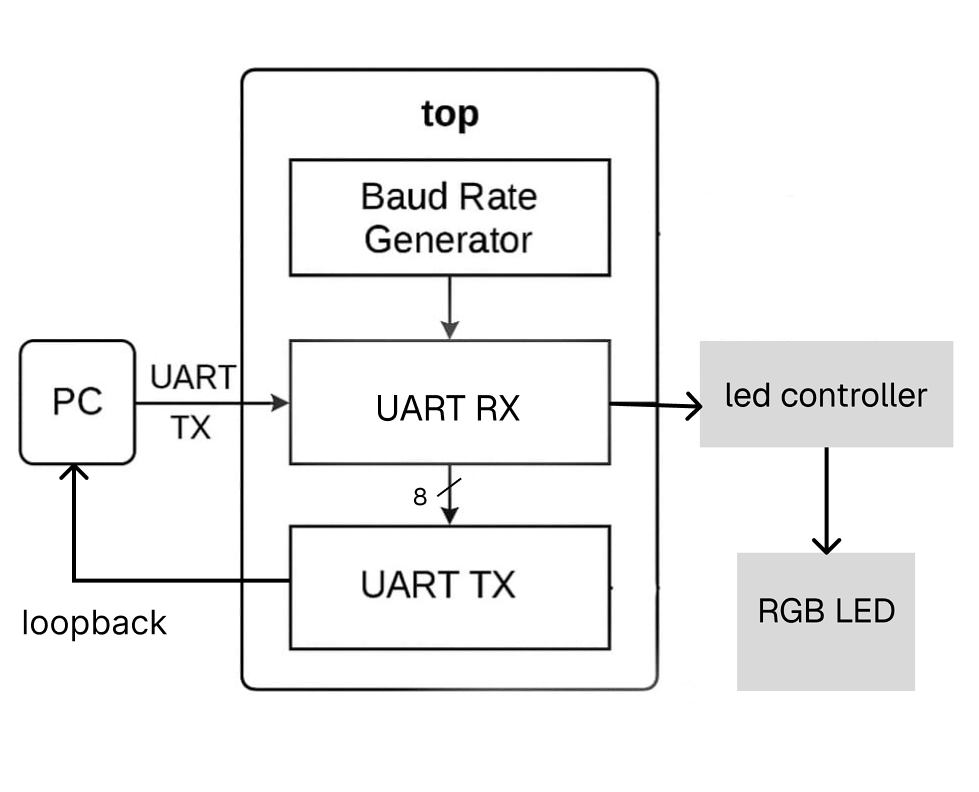

# TASK - 5 & 6

## Purpose of the Module

The Verilog design implements an **FPGA-based RGB LED control system** that receives **ASCII commands** over UART from a PC or serial terminal.  It parses each received command, decodes it and controls three LEDs (Red, Green, and Blue) accordingly.  
It also **echoes back** each received character for confirmation and debugging.

## UART RGB LED Control Architecture



- The **internal oscillator** generates the system clock.
- A **baud rate generator** produces a tick at 9600 baud for the UART logic.
- The **UART receiver ( uart_rx )** listens for incoming serial data.
- The **UART transmitter ( uart_tx )** echoes back each received byte.
- The **LED controller ( led_controller )** decodes commands and drives the RGB LED outputs.
- The **SB_RGBA_DRV primitive** maps the logical RGB outputs to physical pins with adjustable current drive.

## Command Protocol

The FPGA expects single-character ASCII commands:

| Command | Function               |
|---------|------------------------|
| `R`     | Turn **Red LED ON**    |
| `r`     | Turn **Red LED OFF**   |
| `G`     | Turn **Green LED ON**  |
| `g`     | Turn **Green LED OFF** |
| `B`     | Turn **Blue LED ON**   |
| `b`     | Turn **Blue LED OFF**  |           

## Modules Overview

This system consists of four core modules:  
- **UART Receiver** ( uart_rx )  
- **UART Transmitter** ( uart_tx )  
- **LED Controller** ( led_controller )  
- A **Top-Level Module** ( top.v ) that integrates everything.

---

### 1. `top.v`

The `top` module is the heart of the design. It:
- Instantiates:
  - An internal oscillator ( SB_HFOSC ).
  - A baud rate generator for 9600 baud operation.
  - `uart_rx` to receive UART commands.
  - `uart_tx` to echo back received bytes (loopback).
  - `led_controller` to decode commands and control the RGB LEDs.
  - `SB_RGBA_DRV` to drive the physical RGB pins with configured current.

- Controls loopback logic:
  - Receives a byte → sends it back → updates the LED states accordingly.

---

### 2. `uart_rx.v`

Implements a **basic UART receiver**:
- Detects the start bit.
- Shifts in 8 data bits, LSB first.
- Asserts `rxdone` for one clock cycle when a complete byte is received.
- Passes the received byte to the top-level module for further processing.

**Simulation Result:**  


The testbench ([ uart_rx_tb.v ](/UART_actuator/UART_RX_Simulation/uart_rx_tb.v)) verifies the uart_rx by:
- Generating a system clock.
- Producing a 9600 baud tick from a 12 MHz system clock.
- Sending a UART frame (start bit → data bits → stop bit) on the `rx` line.
- Checking if the receiver correctly captures the byte and asserts `rxdone`.

---

### 3. `led_controller.v`

The **led_controller** decodes each received command byte and drives the RGB LED pins:  

```verilog
always @(posedge clk) begin
  if (rx_done) begin
    case (rx_byte)
      8'h52: led_r <= 1'b1; // 'R' → Red ON
      8'h72: led_r <= 1'b0; // 'r' → Red OFF
      8'h47: led_g <= 1'b1; // 'G' → Green ON
      8'h67: led_g <= 1'b0; // 'g' → Green OFF
      8'h42: led_b <= 1'b1; // 'B' → Blue ON
      8'h62: led_b <= 1'b0; // 'b' → Blue OFF
      default: ; // Ignore other bytes
    endcase
  end
end
```
#### Simulation Result :


The testbench ( [led_controller_tb](/UART_actuator/led_controller_simulation/led_controller_tb.v) ) verifies the behavior of the led_controller module by simulating how it responds to specific UART command bytes. It generates a simple clock signal, then sends a series of ASCII command bytes ('R', 'r', 'G', 'g', 'B', 'b') one by one to the module. For each command, it asserts the rx_done signal to simulate a received UART byte, checks whether the appropriate LED control output (led_r, led_g, led_b) turns ON or OFF as expected.

### 4 . `uart_tx.v`

This module implements a **simple UART transmitter**:

- Waits for `senddata` signal.
- Transmits 1 start bit, 8 data bits, and 1 stop bit (8N1 format).
- Asserts `txdone` when transmission completes.


## Pin Configuration

| RGB Channel | FPGA Pin |  Description                  |
|-------------|----------|-------------------------------|
| `RGB0`      | 39       |  Red LED output               |
| `RGB1`      | 40       |  Green LED output             |
| `RGB2`      | 41       |  Blue LED output              |
| `uartrx`    | 14       |  RX input from PC FTDI TXD    |
| `uarttx`    | 15       |  TX output to PC FTDI RXD     |

## Using Picocom Terminal


**Run Picocom:**
```bash
sudo picocom -b 9600 /dev/ttyUSB0
```

Replace `/dev/ttyUSB0` with the actual FTDI device path.

The terminal will show the actual received character.

> Press `Ctrl + A` then `Ctrl + X` to exit Picocom.

## Output Behavior

When the commands like `R` , `r` , `G` , `g` , `B` , `b` are sent the   
corresponding LED will turn ON or OFF instantly and the terminal will show the echoed character.

## Final Output
https://github.com/user-attachments/assets/4b1693ad-346d-47e1-ba33-cc1768e0c5a8


