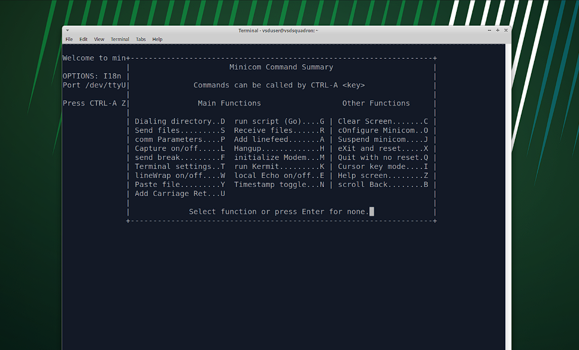

# TASK-2

## Purpose of the Module

The Verilog module `uart.v` implements a **UART loopback mechanism**.  
When data is transmitted from a serial terminal **minicom**, it is immediately received back, verifying the FPGA’s UART functionality.  
## UART loopback mechanism Architecture


```verilog
`include "uart_tx.v"
`include "uart_rx.v"
```
These are Verilog compiler directives that tell the synthesis tool to include the contents of these other Verilog files directly at the spot .

## Module Declaration

```verilog
module uart (
  output wire led_red,   // Red LED: Not used in this design
  output wire led_green, // Green LED: RX done
  output wire led_blue,  // Blue LED: TX active
  output wire uarttx,    // UART TX pin to FTDI RX
  input  wire uartrx,    // UART RX pin from FTDI TX
  input  wire hw_clk     // Not used here
);
```
- **RX pin** receives data from the terminal.
- **TX pin** sends data back to the terminal.
- **LEDs** visually indicate status.

## Transmitter Module : 

 The **UART Transmitter** module takes parallel data ( here it is 8-bit ASCII value of characters ) and converts it into a serial bitstream.  
 It typically frames each byte with a **start bit** and a **stop bit**, shifting out bits at the specified baud rate.  
In this design, when data is available to transmit, the **blue LED** is driven HIGH to show TX is active.
 

## Receiver Module :

The **UART Receiver** module continuously samples the RX line to detect the start bit.  
It then shifts in the incoming bits, reconstructing the original byte.  
Once reception is complete, the **green LED** is driven HIGH, showing that data was successfully received.


## Baud Rate Generator :
The Baud Rate Generator creates the precise timing needed for reliable serial communication.
The FPGA's internal 12 MHz oscillator is divided down by a counter to generate a baud_tick signal.
For a standard 9600 baud connection, the counter waits 1250 clock cycles (12 MHz ÷ 9600) to pulse baud_tick once for each data bit.
This baud_tick drives both the UART Receiver and Transmitter state machines, ensuring that bits are sampled and shifted exactly in sync with the expected serial bit rate.


## About Minicom Terminal

**Minicom** is a text-based serial terminal emulator on Linux.  
It connects to FPGA’s serial port , sends the  ASCII characters to the FPGA & receives looped-back data from the FPGA’s TX line.

Install minicom :  
```bash
sudo apt update
sudo apt install minicom
```

Run minicom : 
```bash
sudo minicom -b 9600 -D /dev/ttyUSB0
```
This runs the minicom terminal with the configuration of device as `/dev/ttyUSB0` and  baud rate `9600` .

### Note : The local echo needs to be enabled in the minicom terminal to view the loopback functionality.
### Go to Special Keys and enable the local Echo by pressing E . 

## PCF File Configuration

Maps logical Verilog ports to physical FPGA pins for the **VSDSquadron Mini Board**:

| Signal Name | FPGA Pin | Description                     |
|-------------|----------|---------------------------------|
| led_green   | 40       | Drives green LED (RX done)      |
| led_red     | 39       | Drives red LED (unused)         |
| led_blue    | 41       | Drives blue LED (TX active)     |
| uarttx      | 14       | UART TX pin                     |
| uartrx      | 15       | UART RX pin                     |
## Integrating with VSDSquadron FPGA Mini Board

The **Linux environment** and **FPGA toolchain** are set up as per the  
[VSDSquadron datasheet](https://www.vlsisystemdesign.com/wp-content/uploads/2025/01/datasheet.pdf).


Command to Build and flash :
```bash
make clean
make build
sudo make flash
```

- `make clean`: Remove old build files.
- `make build`: Synthesize the design.
- `sudo make flash`: Program the FPGA with the bitstream.

## Output Behavior

- The character is sent via **minicom** → FPGA RX Module receives it → **green LED** lights up.
- FPGA loops back the data → TX Module sends data back → **blue LED** lights up.
- The character is printed back on the minicom terminal which conforms it's functionality.
## Final Output
