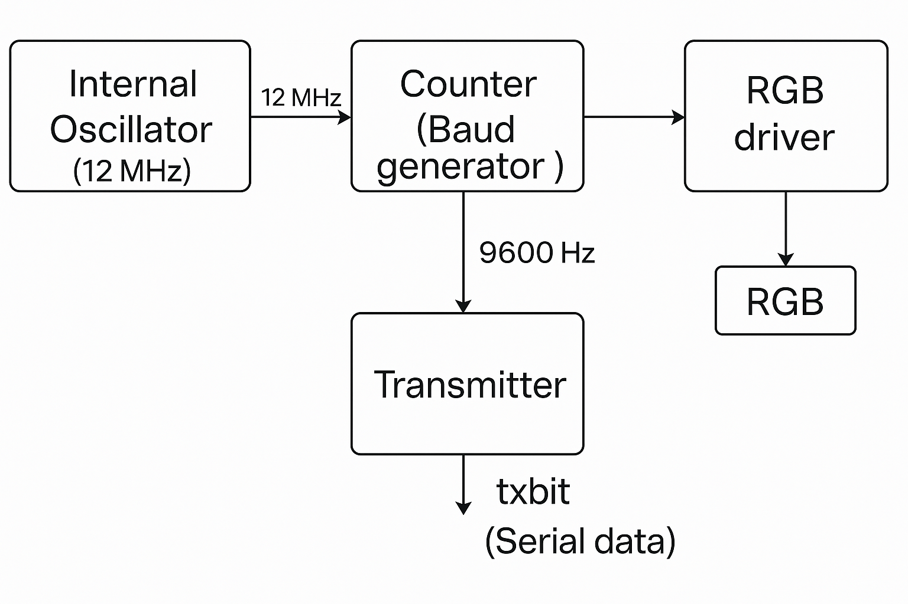
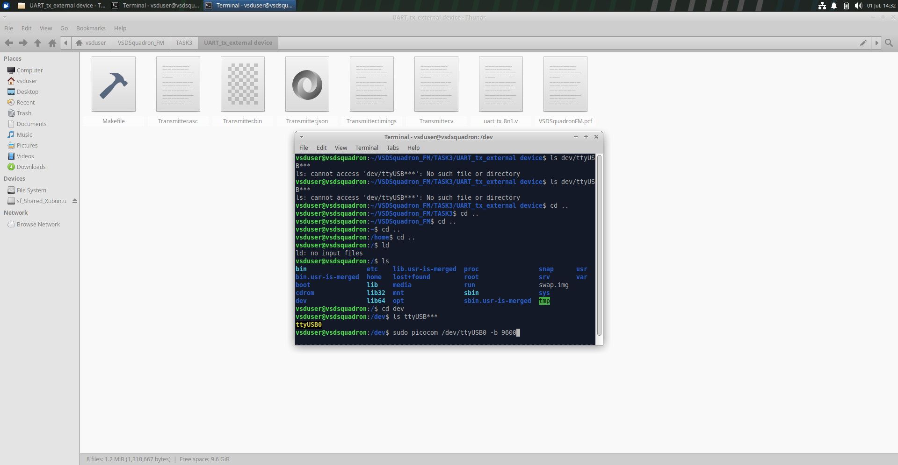

# TASK-3


## Purpose of the Module

The Verilog module `Transmitter.v` implements a **UART transmitter**.  
This module continuously sends character 'D' using UART protocol from the FPGA's TX pin to the connected external device  
( PC ).

## UART Transmitter Architecture



- **TX pin ( txbit --> tx --> uarttx )** transmits serial data to the external receiver (e.g., PC).


## Transmitter Module

The **UART transmitter** (`uart_tx_8n1.v`) converts an 8-bit ASCII character into a serial bitstream using the **8N1 protocol** (1 start bit, 8 data bits, 1 stop bit).  
It continuously sends the character when triggered by the internal counter.

## Baud Rate Generator

The design divides the FPGA’s internal **12 MHz clock** down to **9600 baud** using a counter.
This ensures precise bit timing for the UART transmission.

## State diagram of Transmitter Module 

## PCF File Configuration

| Signal Name | FPGA Pin | Description          |
|-------------|----------|----------------------|
| uarttx      | 14       | UART TX pin to FTDI  |
| led_green   | 40       | Optional LED         |
| led_red     | 39       | Optional LED         |
| led_blue    | 41       | Optional LED         |

## Build and Flash

```bash
make clean
make build
sudo make flash
```

- `make clean` — Removes old builds.
- `make build` — Synthesizes the bitstream.
- `sudo make flash` — Programs the FPGA.
## Using Picocom Terminal

the **Picocom** serial terminal is used to receive the transmitted data on your PC.

**Install Picocom:**

```bash
sudo apt update
sudo apt install picocom
```

**Run Picocom:**

```bash
sudo picocom -b 9600 /dev/ttyUSB0
```

Replace `/dev/ttyUSB0` with your actual device.
### Note : Move into the /dev directory if you don't have access to the actual device. 


### Picocom running :
 
- Press ctrl + A then ctrl + X to exit picocom
## Output
Once running, the serial terminal will display the transmitted character continuously, confirming the UART transmitter works.
## Final Output 
https://github.com/user-attachments/assets/f4680b41-391b-4b66-9004-a894ab15510f

