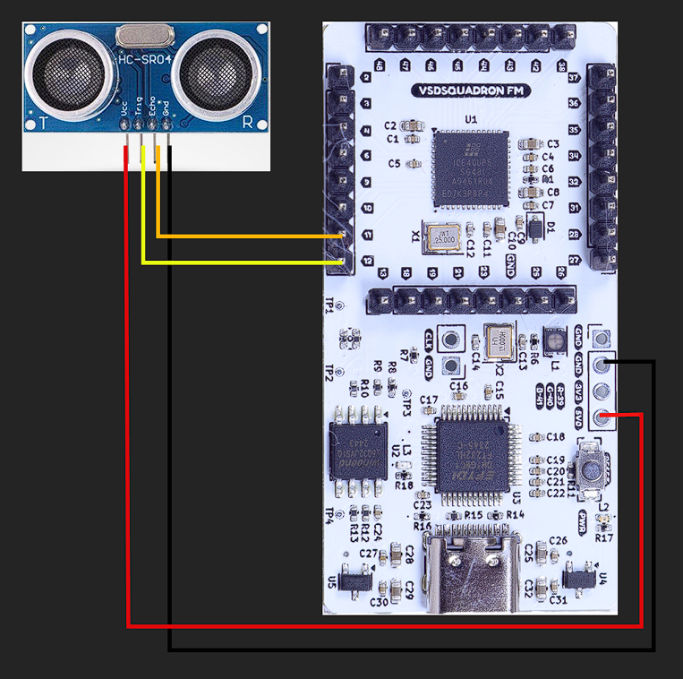

# TASK-4

## Purpose of the Module

The Verilog module `top.v` implements an ultrasonic distance measurement system with an HC-SR04 sensor, measures the echo time, converts the measured distance to ASCII and transmits it via a UART transmitter to a connected external device (e.g., PC).

## UART Distance Measurement Architecture


- The Trigger pin (`trig_pin`) generates a ~10µs pulse every 60ms to trigger the HC-SR04 sensor.
- The Echo pin (`echo_pin`) receives the returned pulse which is timed to calculate distance.
- The measured distance is converted to BCD, then mapped to ASCII.
- The TX pin (`uart_tx`) sends the distance in centimeters over UART to the PC.
## Ultrasonic sensor  
The ```HC-SR04``` is a widely used ultrasonic ranging module designed to measure distance to an object by using sound waves.
It works on the principle of ultrasonic echolocation. [more on this here.](https://www.geeksforgeeks.org/electronics-engineering/arduino-ultrasonic-sensor/) 

### Trigger Pulse Generator
```verilog
reg [19:0] trig_counter = 0;
reg trig_reg = 0;

always @(posedge clk_int) begin
    if (trig_counter < 720_000)
        trig_counter <= trig_counter + 1;
    else
        trig_counter <= 0;

    if (trig_counter < 120)
        trig_reg <= 1;
    else
        trig_reg <= 0;
end

assign trig_pin = trig_reg;
```

It periodically generates a ~10 µs HIGH pulse on trig_pin every ~60ms.
This pulse triggers the HC-SR04 ultrasonic sensor to send a sound wave.
trig_reg goes HIGH for 120 clock cycles → ```sets trig_pin HIGH``` .
### Echo Timer
Measures the width of the echo signal from the sensor. When echo_pin goes HIGH → resets and starts counting (echo_counter).
When echo_pin goes LOW → stores echo_counter value in echo_pulse and sets echo_done HIGH.
This gives the ```pulse duration```. 
```verilog
reg echo_prev = 0;
reg [31:0] echo_counter = 0;
reg [31:0] echo_pulse = 0;
reg echo_done = 0;

always @(posedge clk_int) begin
    echo_prev <= echo_pin;

    if (echo_prev == 0 && echo_pin == 1) begin
        echo_counter <= 0;
        echo_done <= 0;
    end else if (echo_pin == 1) begin
        echo_counter <= echo_counter + 1;
    end else if (echo_prev == 1 && echo_pin == 0) begin
        echo_pulse <= echo_counter;
        echo_done <= 1;
    end else begin
        echo_done <= 0;
    end
end
```
## Distance Calculator
```verilog
reg [15:0] distance_cm = 0;

always @(posedge clk_int) begin
    if (echo_done)
        distance_cm <= echo_pulse >> 6; 
end
```
Converts the echo pulse duration to ```distance in centimeters```.
Simple shift right operation >> 6 divides by 64 → scaling factor for the HC-SR04.
### Note: A right-shift operation is used instead of a direct division to scale the echo time into distance. This makes the operation fully synthesizable and hardware-friendly, as division needs much more logic blocks in FPGA logic. Shifting by n is equivalent to dividing or multiplying by 2 ^ n.

## BCD & ASCII converter
The result, ```distance_cm``` is still a binary integer . For it to be human readble it needs to be converted to decimal .The PC UART picocom terminal expects ASCII characters , so it needs to be converted into ASCII for UART transmission .


## Baud Rate Generator
A counter divides the FPGA’s internal **12 MHz clock** down to **9600 baud**, providing precise UART timing.
## UART Transmitter

The **UART transmitter** (`uart_tx_8n1.v`) converts the ASCII characters for the distance value to a serial bitstream using the **8N1 UART protocol** (1 start bit, 8 data bits, 1 stop bit).  
It transmits formatted data in the form `D: 123 cm` for every measurement cycle.


## PCF File Configuration

| Signal Name | FPGA Pin | Description                 |
|-------------|----------|-----------------------------|
| uart_tx     | 14       | UART TX pin to FTDI RXD     |
| trig_pin    | 12       | HC-SR04 Trigger pin         |
| echo_pin    | 11       | HC-SR04 Echo pin (input)    |
| led         | 40       | LED indicates measurement   |
### Circuit diagram :



## Build and Flash

```bash
make clean
make build
sudo make flash
```

- `make clean` — Removes previous build files.
- `make build` — Synthesizes and generates the bitstream.
- `sudo make flash` — Programs the FPGA.

## Using Picocom Terminal

**Picocom** is used to view the transmitted distance data on PC.

**Install Picocom:**

```bash
sudo apt update
sudo apt install picocom
```

**Run Picocom:**

```bash
sudo picocom -b 9600 /dev/ttyUSB0
```

Replace `/dev/ttyUSB0` with your actual FTDI device path.  

> Press `Ctrl + A` then `Ctrl + X` to exit Picocom.

## Output

When running, the terminal continuously displays the measured distance in the format:

```
D: 23 cm
```

This confirms the ultrasonic sensor, distance calculation logic and UART transmitter are working correctly.

## Final Output

https://github.com/user-attachments/assets/76fd7779-dbf6-470a-ae4e-dcb67f175cb8
